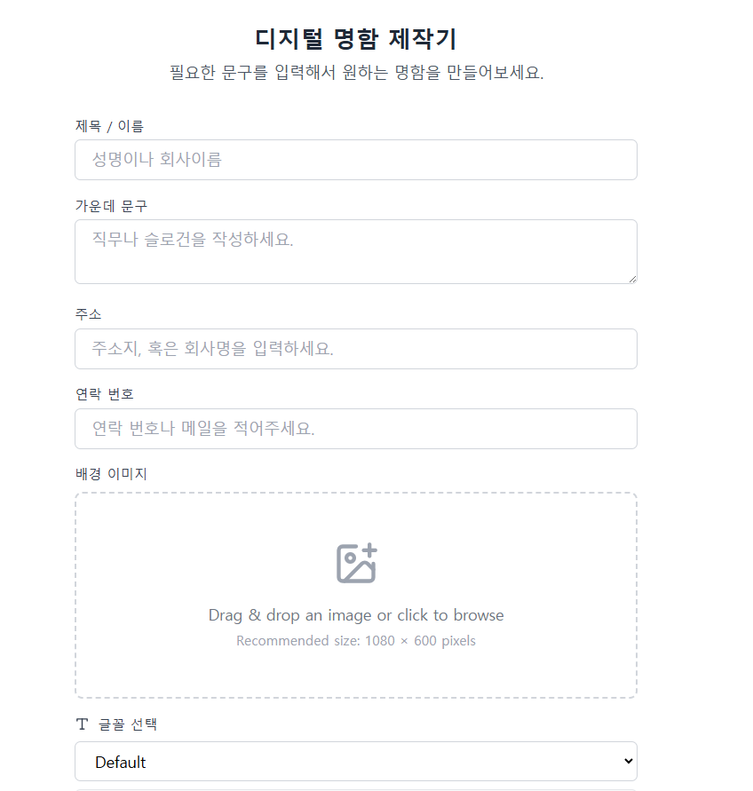
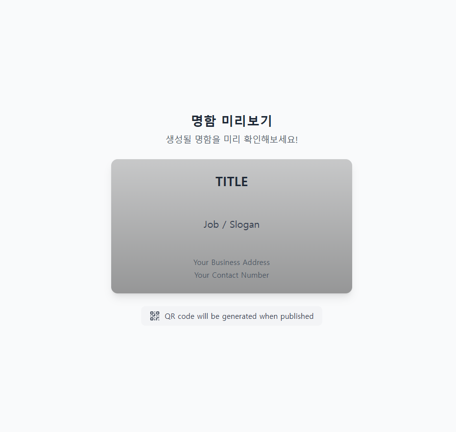
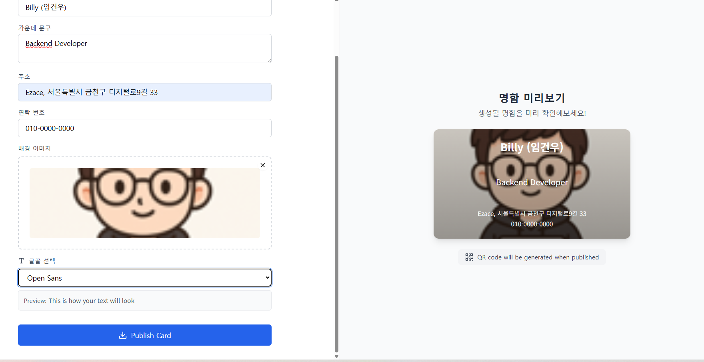

# 디지털 카드 메이커 (Digital Card Maker)

## 프로젝트 소개
간단하게 디지털 명함을 만들 수 있는 웹 애플리케이션입니다. 사용자가 원하는 텍스트와 배경을 선택하여 커스텀 명함을 제작할 수 있습니다.

## 주요 기능
- 명함 제목/이름 설정
- 연락처 정보 입력
- 커스텀 배경 이미지 설정
- 실시간 미리보기
- 반응형 디자인

## 기술 스택
- React
- TypeScript
- TailwindCSS

## 설치 및 실행

```bash
# 저장소 클론
git clone https://github.com/lgw2238/digital-card-maker.git

# 의존성 설치
npm install

# 개발 서버 실행
npm run dev
```

### 도메인 이미지

<div style="display: flex; justify-content: space-between;">
  
  
  
</div>